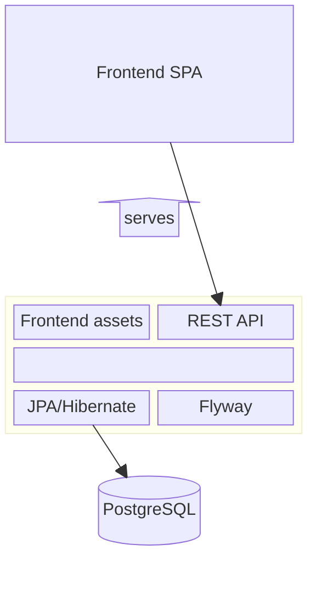

# Quizmaster Architecture

Quizmaster follows a traditional client-server architecture.

## Frontend
Frontend is a Single-Page Application (SPA) in [React 19](https://react.dev/). It uses [react-router](https://reactrouter.com/) for routing.

## Backend
Backend is a Spring Boot application, serving both frontend as a SPA (Single-Page Application) at URL `\`, and REST APIs for the frontend at URLs starting with `\api\`.
- Uses [Lombok](https://projectlombok.org/) to reduce boilerplate code.

Data are stored in PostgreSQL dabatase.
- DB is accessed using JPA/Hibernate,
- data scheme versioned and migrated using Flyway.

## Component Diagram

